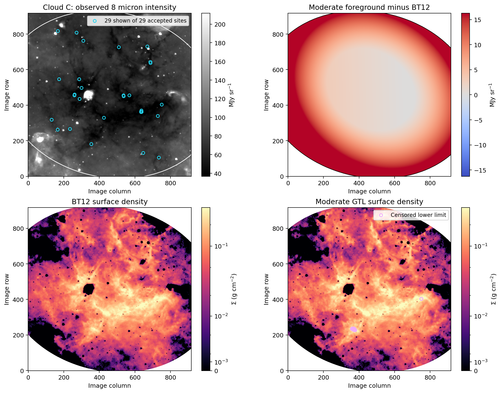
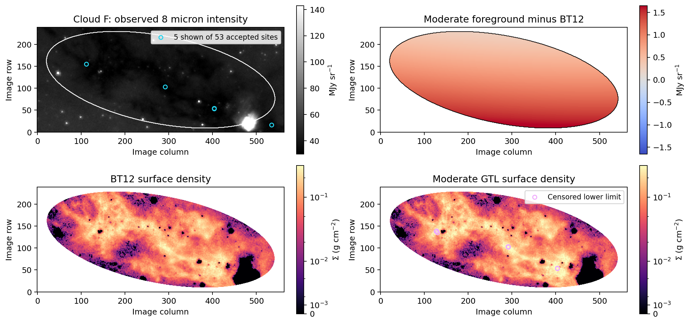
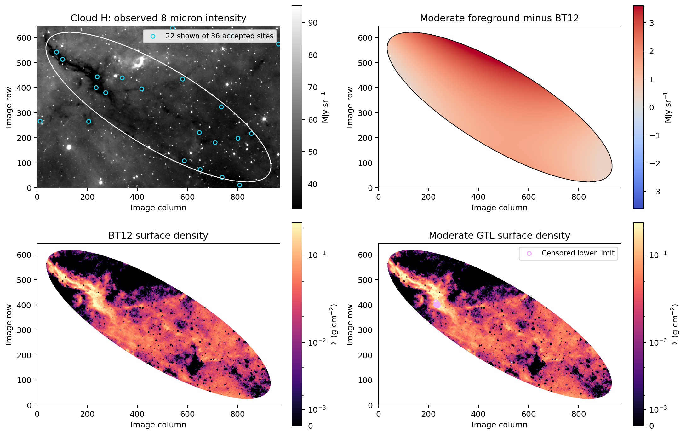

Cloud comparisons
=================

Clouds C, F, and H provide three independent checks of the same mapping
interface. The package reads each cloud ellipse from ``catalog.dat``, detects
foreground samples across the full image, and applies BT12 and the three GTL
profiles without changing the catalog geometry by hand.

How to read the figures
-----------------------

Each figure follows the calculation from input image to surface density:

1. Observed intensity shows the 8 micron image. The white curve is the
   Simon catalog ellipse. Cyan circles mark accepted foreground sample sites
   in the displayed crop; the legend also gives the total detected in the
   full image.
2. Foreground change shows the moderate spatial foreground minus the BT12
   constant. Positive values show where the moderate profile raises the
   foreground; the ordered profile cannot fall below BT12.
3. BT12 surface density uses the constant BT12 foreground.
4. Moderate GTL surface density uses the spatial foreground. Hollow
   magenta circles identify finite censored lower limits. They are not NaNs
   and should not be treated as ordinary detections.

The two surface density panels share a color scale within each cloud. Their
maps and comparison sums are restricted to the catalog ellipse. Cloud C uses
its prepared SMF background; Clouds F and H use the SMF estimator included in
GTLMapping. Within each cloud, all foreground profiles use the same image,
background, opacity, aperture, and bright pixel policy.

Cloud C
-------

Cloud C has 29 unique sample sites. Moderate GTL keeps the dense cloud
structure visible while replacing the constant foreground with a broad
spatial surface. Relative to BT12, the conservative, moderate, and liberal
sums increase by 3.91%, 13.15%, and 22.22%. Moderate GTL contains 77 censored
lower limits; liberal GTL contains 762.

Cloud F
-------

Cloud F has 53 unique sample sites. The moderate foreground changes smoothly
along the long axis of the cloud without copying its filamentary structure.
The conservative, moderate, and liberal sums increase by 1.38%, 9.89%, and
16.67%. Moderate GTL contains 9 censored lower limits; liberal GTL contains
81.

Cloud H
-------

Cloud H has 36 unique sample sites. Its moderate foreground has a stronger
gradient than Cloud F, while the bright filament remains distinct in the
surface density map. The conservative, moderate, and liberal sums increase by
2.26%, 8.39%, and 25.56%. Moderate GTL contains 26 censored lower limits;
liberal GTL contains 259.

Profile comparison
------------------

.. list-table:: Change in summed nonnegative surface density relative to BT12
   :header-rows: 1

   * - Profile
     - Cloud C
     - Cloud F
     - Cloud H
   * - Conservative
     - +3.91%
     - +1.38%
     - +2.26%
   * - Moderate
     - +13.15% (77 lower limits)
     - +9.89% (9 lower limits)
     - +8.39% (26 lower limits)
   * - Liberal
     - +22.22% (762 lower limits)
     - +16.67% (81 lower limits)
     - +25.56% (259 lower limits)

These sums compare numerical behavior under fixed inputs. They are not
independent mass measurements, and a larger number of censored pixels does
not by itself make a foreground model more physical. A scientific analysis
should compare the foreground surface with independent column density data
and vary the anchor and censoring limits.

The figures can be regenerated with
``examples/cloud_profile_comparisons.py``. The exact counts and foreground
ranges are available in the :download:`machine readable summary
<_static/cloud_method_summary.json>`.
