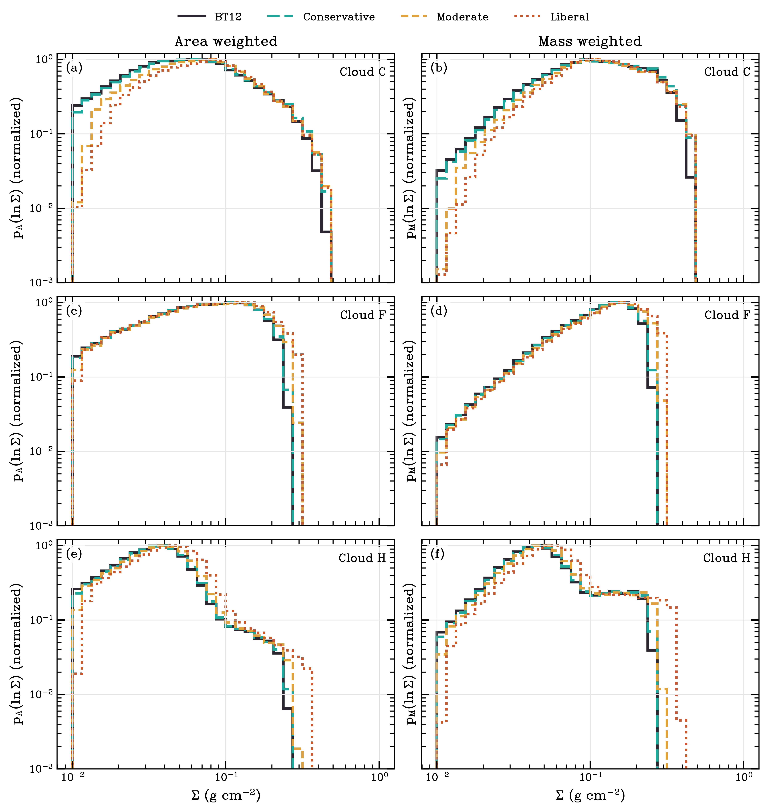

Cloud comparisons
=================

Clouds C, F and H use the same catalog interface and presets. Within each
cloud, the image, background, aperture, opacity and intensity threshold stay
fixed across profiles. These are IRAC4 comparisons; Cloud H here is not the
JWST/MIRI field.

The figures show intensity, the moderate-minus-BT12 foreground, and the two
surface-density maps. Saffron crosses mark unresolved transmission. Those
finite values are sensitivity limits, excluded from detection-only PDFs.

Cloud C
-------

The scan yields 29 sites, all inside the aperture. The cutout truncates the
catalog ellipse, so the comparison uses the ellipse-image overlap.
Cloud C uses its prepared SMF background. Both supplied files lack a BUNIT
keyword; this comparison adopts MJy/sr, which must be verified against the
parent mosaic for an absolute calibration.

.. image:: _static/cloud_c_method.png
   :alt: Cloud C intensity, foreground change, BT12 and moderate surface densities
   :width: 100%

Cloud F
-------

The scan yields 53 sites, of which four lie inside the cloud aperture.
An aperture-restricted scan leaves three sites and cannot support a general
quadratic. The foreground depends on sites beyond the summed region.

.. image:: _static/cloud_f_method.png
   :alt: Cloud F intensity, foreground change, BT12 and moderate surface densities
   :width: 100%

Cloud H
-------

The scan yields 36 sites, including 16 inside the aperture. Clouds F and H
use the package SMF estimator and their complete catalog ellipses.

.. image:: _static/cloud_h_method.png
   :alt: Cloud H intensity, foreground change, BT12 and moderate surface densities
   :width: 100%

Integrated comparison
---------------------

All profiles use a threshold of 1.2 MJy/sr, twice the adopted image noise of
0.6 MJy/sr. Finite sensitivity limits are included in each nonnegative sum.

.. list-table:: Change relative to BT12
   :header-rows: 1

   * - Profile
     - Cloud C
     - Cloud F
     - Cloud H
   * - Conservative
     - +3.90%
     - +1.37%
     - +2.22%
   * - Moderate
     - +13.10%
     - +9.63%
     - +8.20%
   * - Liberal
     - +22.10%
     - +15.61%
     - +24.97%

.. list-table:: Unresolved pixels (strict zero-crossing counts in parentheses)
   :header-rows: 1

   * - Profile
     - Cloud C
     - Cloud F
     - Cloud H
   * - BT12
     - 22 (0)
     - 15 (0)
     - 25 (0)
   * - Conservative
     - 68 (0)
     - 20 (0)
     - 54 (0)
   * - Moderate
     - 243 (77)
     - 268 (9)
     - 112 (26)
   * - Liberal
     - 1186 (762)
     - 833 (81)
     - 616 (259)

Five of six moderate/liberal strict counts reach their ceiling. Liberal
Cloud F reaches its near-saturation ceiling instead. These counts describe
active fitting constraints, not independent discoveries of opaque gas.
The foreground order is imposed; larger sums alone cannot establish more
accurate masses. See :doc:`validation` for recovery tests and failures.

The :download:`input manifest <_static/input_manifest.json>` records input
hashes, extensions, units and dependency versions. Raw data and preprocessing
recipes still require an author-verified archive.

The :download:`comparison data <_static/cloud_method_summary.json>` include
detected-only sums, finite-limit contributions and fit diagnostics.

Surface-density distributions
-----------------------------

Each cloud uses the same pixels across profiles: finite, non-bright,
resolved, and above 0.01 g/cm² in every profile. A further cut requires
transmission above 1.8 MJy/sr in every profile. This is three times the
adopted image noise; it omits foreground uncertainty and does not establish
completeness.

The fraction of mapped mass above 0.2 g/cm² changes from 19.75% to 21.95%
in C, 8.32% to 21.21% in F, and 3.02% to 8.21% in H between BT12 and liberal
GTL. The enhancement persists after removing weak transmission. These
conditional distributions do not establish a global lognormal or power-law
tail.

The :download:`distribution data <_static/sigma_pdf_profiles.csv>` retain
bin edges and normalization. Sensitivity records vary the
:download:`residual cut <_static/pdf_threshold_sensitivity.json>`,
:download:`stored threshold <_static/threshold_sensitivity.json>`,
:download:`Cloud F sample support <_static/sample_sensitivity_f.json>` and
:download:`Cloud F budgets <_static/budget_sensitivity_f.json>`.
