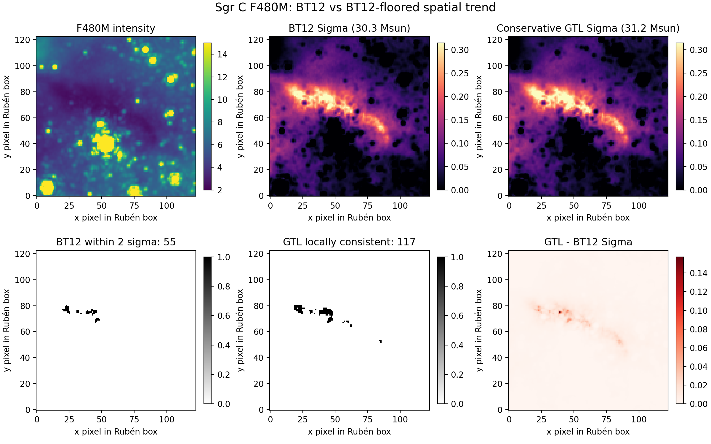

JWST Sgr C audit
=================

Local data provenance
---------------------

The two local files named ``F480M_registered.fits`` and
``F480M_registered (1).fits`` are byte-identical. They contain:

* an empty primary HDU;
* a 5660 by 2300-pixel ``SCI`` image in MJy sr\ :sup:`-1`; and
* a matching ``ERR`` standard-deviation image in MJy sr\ :sup:`-1`.

The Rubén Fedriani correspondence identifies the eastern filament
cutout as rows 1980:2103 and columns 77:200, using stop-exclusive NumPy
slices. The cutout is 123 by 123 pixels at 0.06293 arcsec per pixel.

BT12 reproduction
-----------------

Within that cutout:

* the median ERR value is 0.1023237 MJy sr\ :sup:`-1`;
* the intensity minimum is 2.3683054 MJy sr\ :sup:`-1`;
* 129 pixels fall strictly between the minimum and
  :math:`I_\mathrm{min}+2\sigma`;
* 49 of those pixels are at least 0.74 arcsec from the minimum; and
* the BT12 mean-minus-:math:`2\sigma` foreground is
  2.3053355 MJy sr\ :sup:`-1`.

These values reproduce the supplied manuscript's error-based BT12
procedure and validate the SCI/ERR/WCS interface. The final mass still
depends on the exact adjacent background boxes and aperture. Those
regions were shown graphically in the manuscript but were not present
as machine-readable region files in the supplied material, so a
bit-for-bit Rubén mass reproduction is not claimed.

Controlled BT12/GTL comparison
------------------------------

With an 8-by-8 overlapping GTL scan, 0.74-arcsec independent separation,
and edge completion, this cutout yields 56 accepted windows and 49
unique sample coordinates. Those minima range from 2.399 to
6.064 MJy sr\ :sup:`-1`; their wide range is the key warning that they
cannot all be treated as direct foreground measurements.

For a reproducible pressure test, five target-sized boxes touching the
north, northeast, east, southeast, and south sides of the target were
used. Pixels above 15 MJy sr\ :sup:`-1` were excluded. The box medians
are 6.858, 7.823, 7.285, 8.684, and 5.683 MJy sr\ :sup:`-1`, giving a
shared background of 7.267 MJy sr\ :sup:`-1`. These are explicit
comparison boxes, not a claim to recover Rubén's unpublished box
coordinates.

Using the same image, background, opacity
(:math:`\kappa_{\mathrm{F480M}}=9.76` cm\ :sup:`2` g\ :sup:`-1`),
gas/dust ratio 156, 8.15-kpc distance, pixel area, and bright-pixel
policy gives:

.. list-table::
   :header-rows: 1

   * - Result in the 123-by-123 box
     - BT12
     - GTL
   * - Foreground, min/median/max (MJy sr\ :sup:`-1`)
     - 2.305 / 2.305 / 2.305
     - 2.330 / 2.371 / 2.411
   * - Detected-only mass (M\ :sub:`sun`)
     - 30.35
     - 31.24
   * - Mass with saturation lower limits (M\ :sub:`sun`)
     - 30.35
     - 31.24
   * - Relative to BT12
     - 1.00
     - 1.030

The conservative result is stable to the tested numerical choices.
Varying the background over the one-standard-deviation scatter of the
five box medians gives GTL/BT12 mass ratios of 1.026--1.036. Changing
``grid_n`` from 4 through 10 gives 31.16--31.49 M\ :sub:`sun` and
ratios of 1.027--1.038.
Dilating the bright-source mask by three and six pixels gives ratios of
1.031 and 1.033.

The corrected result implements the intended BT12 lower-bound
invariant: all 15,129 pixels in the cutout satisfy
:math:`\Sigma_\mathrm{GTL}\geq\Sigma_\mathrm{BT12}`, so the integrated
mass cannot decrease under the shared background and mask. Rubén's
exact background and source-mask regions are still needed before
assigning a publication value.

Saturation terminology
----------------------

The BT12 *selection* contains 129 pixels near the global minimum, of
which 49 meet the independence separation. The GTL scan also has 49
unique minima; it does **not** create more independent foreground
measurements. That selection count is distinct from a map-level
``within 2 sigma of the fitted foreground`` count. Under the latter
common definition, BT12 has 55 pixels and GTL has 117.

The initial direct-kriging model made 4,387 pixels locally
saturation-consistent and 3,089 strict lower limits. It also reproduced
a filament-shaped trough in the foreground and erased the extinction
morphology. That result was a failed model diagnostic, not evidence for
increased saturation, and is withdrawn.

The replacement fits a robust plane but applies BT12 as a hard
pointwise floor. Its automatic blend factor is 0.03, leaving 117
locally saturation-consistent pixels and zero strict lower limits.
Across ``grid_n=4`` through 10 the local counts are 113--136 and the
strict count remains zero. The filament remains visible, no
interpolation-shaped foreground structure is divided out of the map,
and the GTL-minus-BT12 surface-density map is nonnegative everywhere.

Uncertainty treatment
---------------------

The FITS products carry first-order per-pixel uncertainty from the
``ERR`` image, the standard error among background-box medians, the
robust-plane covariance, and a 30% opacity term. Those terms are useful
for detected pixels, but they must not be blindly summed as independent
pixels: background, foreground-trend, drizzle, and opacity errors are
spatially correlated.

For an integrated mass, the recommended report is therefore layered:

* quote the detected-pixel mass separately from any censored
  lower-limit sum;
* give the measured background, grid, and source-mask scenario ranges;
* quote the 30% opacity scale as a fully correlated systematic
  (9.10 M\ :sub:`sun` for BT12 and 9.37 M\ :sub:`sun` for GTL here);
  and
* do not assign a symmetric Gaussian error to saturated lower limits.

A publication-grade posterior should vary a common background offset,
the spatial foreground realization, source mask, opacity, and distance
in a Monte Carlo or censored Bayesian calculation. The current analytic
map errors remain intentionally masked at censored pixels.

Opacity normalization
---------------------

The correspondence reports the moderately coagulated OH94 thin-ice
F480M opacity as about 9.76 cm\ :sup:`2` g\ :sup:`-1` for gas/dust 156.
The supplied manuscript also reports 15.23 cm\ :sup:`2` g\ :sup:`-1`
for gas/dust 100. GTLMapping treats these as the same filter
convolution under different total-mass normalizations:

.. math::

   9.76 \times \frac{156}{100} = 15.2256.

No additional F480M file or opacity number is needed for the included
registry. Extending the package to arbitrary filters and dust models
would require the raw OH94 opacity table, chosen filter throughputs,
and a documented weighting convention.

Reproduce the pressure test
---------------------------

From the repository root, with the plotting extra installed:

.. code-block:: console

   python examples/sgrc_f480m_compare.py F480M_registered.fits

This writes BT12 and GTL FITS maps, a comparison figure, and a JSON
record of the assumptions and sensitivity tests under
``validation/sgrc_f480m``. Replace
``touching_background_boxes`` in the example when Rubén's exact
machine-readable regions are available.

Slide audit
-----------

The supplied project slides correctly motivate spatially varying
foreground emission and retain BT12 as a comparison method. However,
the radiative-transfer fraction shown on slides 7 and 17 is inverted.
The implemented and manuscript-consistent equation is:

.. math::

   \tau=-\ln\left[
   \frac{I_\mathrm{obs}-I_\mathrm{fg}}
        {I_\mathrm{bg}-I_\mathrm{fg}}\right].

The slide claim that the new foreground adds approximately
:math:`10^5` solar masses to Cloud C is not yet a validated package
result. It requires a fixed aperture, distance, NIR correction,
source-mask policy, opacity normalization, and propagated uncertainty
before it should be used as a publication statement.
