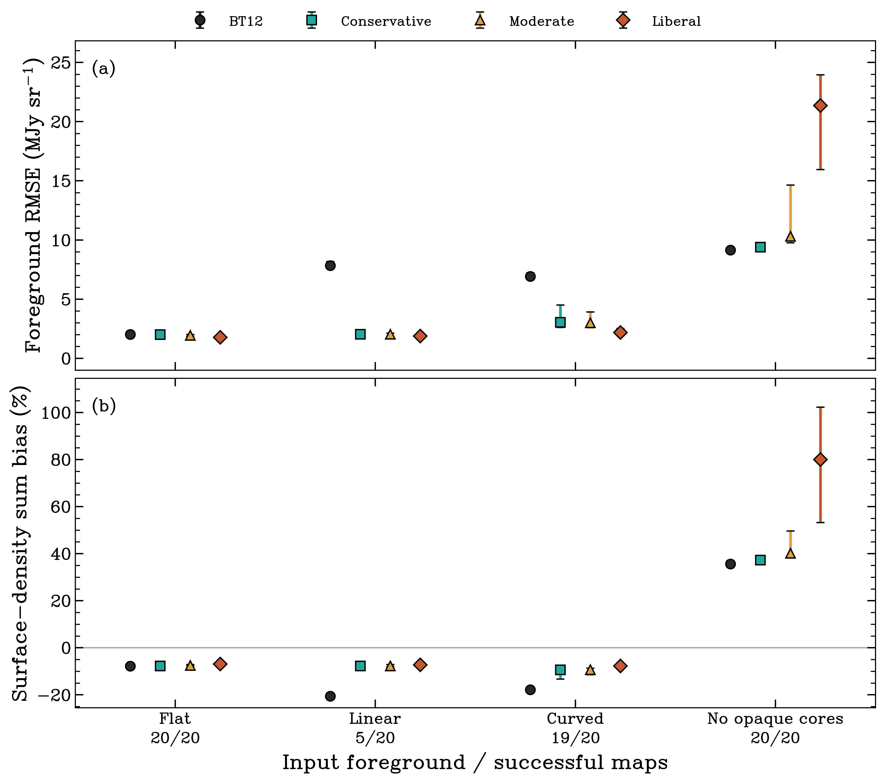

Validation
==========

Software checks
---------------

The suite tests FITS/WCS handling, catalog apertures, background estimators,
foreground fits, opacity conventions and radiative transfer. It also checks
weak positive transmission, the zero crossing, spatial thresholds,
rank-deficient trends, and separate strict and unresolved masks.

.. code-block:: console

   python -m pytest

Passing these tests establishes implementation behavior. Physical recovery
is a separate question.

Injection and recovery
----------------------

The suite uses 220 synthetic images and 880 attempted profile fits. Eleven
scenes each have 20 realizations, with fixed presets and new random seeds.
The 128 by 128 pixel images have 0.6 arcsec pixels, a filament and a known
unobscured background. Most scenes include 16 opaque cores. The reference
column is derived from noiseless PSF-convolved intensity and foreground.

The baseline PSF has one-pixel Gaussian dispersion. Correlated noise has
rms 0.6 MJy/sr. Every profile uses a threshold of twice that noise. Recovery
is measured where true transmission exceeds three times the noise. The
statistic includes finite algorithmic limits on this truth-defined sample.

.. list-table:: Median percentage sum bias, conditional on successful fits
   :header-rows: 1

   * - Scene
     - Successes
     - BT12
     - Conservative
     - Moderate
     - Liberal
   * - Constant
     - 20/20
     - -7.78
     - -7.72
     - -7.52
     - -6.91
   * - Linear
     - 5/20
     - -20.58
     - -7.75
     - -7.75
     - -7.26
   * - Quadratic
     - 19/20
     - -17.81
     - -9.36
     - -9.30
     - -7.73
   * - No opaque cores
     - 20/20
     - +35.65
     - +37.26
     - +40.18
     - +79.99

Spatial fits improve recovery in successful gradient tests. The failure
rate matters: the linear scene often lacks a BT12 reference meeting the
partner criterion, and all named GTL profiles require that reference.
Without opaque cores, transmitted background in minima is mistaken for
foreground and the column is overestimated.

Additional scenes test non-quadratic structure, background errors of plus
or minus 10%, doubled noise, stronger noise correlation, a broader PSF and
only four opaque cores. No profile succeeds in the four-core scene under
these settings. Broader-PSF success counts differ by profile and are
reported separately. These experiments do not establish a universal mass
correction or calibrated confidence intervals.

.. code-block:: console

   python examples/recovery_validation.py --output validation/recovery

The :download:`trial records <_static/recovery_trials.json>` include failures
and their causes. The :download:`summary <_static/recovery_summary.json>`
reports medians and 16th/84th percentiles among successes. These percentiles
describe realization scatter, not confidence intervals on a mean.

Observational tests
-------------------

The :doc:`cloud_comparisons` page gives reruns of C, F and H with one shared
threshold. Their foreground fits are unchanged; detected and unresolved
contributions are reported separately.

The :doc:`jwst_sgrc` example uses the same F480M target, opacity, background
and source rule for BT12 and conservative GTL. Its finite-map ratio is
1.0264, with 55 and 117 unresolved pixels.

A physical accuracy claim needs an independent column-density comparison
at matched resolution and consistent line-of-sight and opacity conventions.
The observations establish foreground sensitivity; the synthetic tests
identify specified recovery regimes and failures.
